# Frosthaven Keyword & Symbol Mapping

This document maps gameplay symbols found on Frosthaven components (Character Mats, Ability Cards, Item Cards) to the standardized `<TAG>` placeholders used in the application's data files.

## Elements (Black & White / Inline)
| Symbol | Tag | Source Icon |
| :--- | :--- | :--- |
|  | `<FIRE>` | `fh-fire-bw-icon.png` |
|  | `<ICE>` | `fh-ice-bw-icon.png` |
|  | `<AIR>` | `fh-air-bw-icon.png` |
|  | `<EARTH>` | `fh-earth-bw-icon.png` |
| 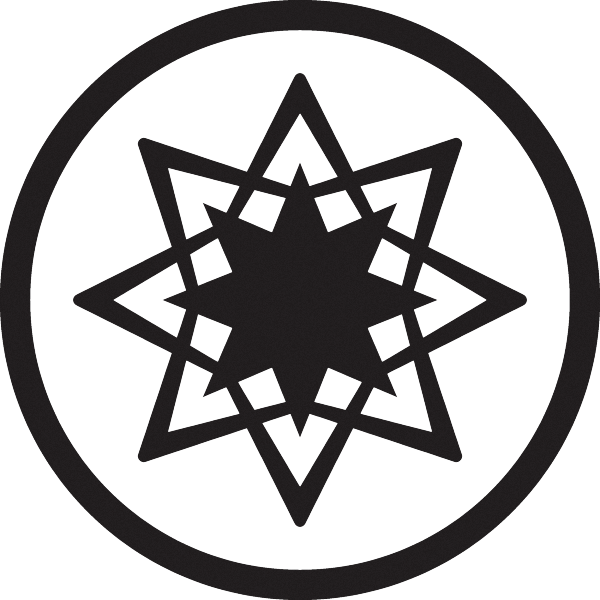 | `<LIGHT>` | `fh-light-bw-icon.png` |
|  | `<DARK>` | `fh-dark-bw-icon.png` |

## Primary Actions
| Symbol | Tag | Source Icon |
| :--- | :--- | :--- |
| 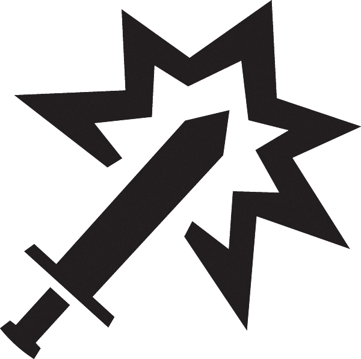 | `<ATTACK>` | `fh-attack-bw-icon.png` |
| 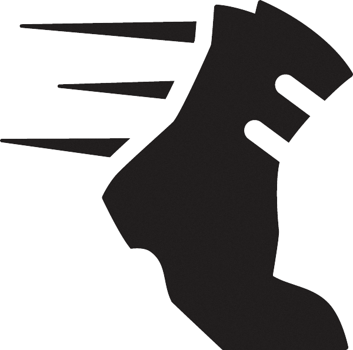 | `<MOVE>` | `fh-move-bw-icon.png` |
| 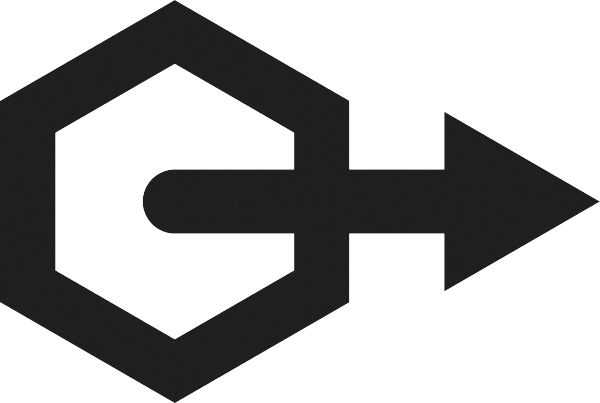 | `<RANGE>` | `fh-range-bw-icon.png` |
|  | `<TARGET>` | `fh-target-bw-icon.png` |
| 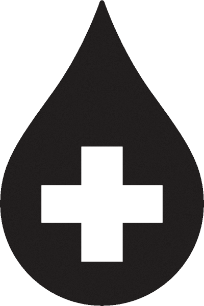 | `<HEAL>` | `fh-heal-bw-icon.png` |
| 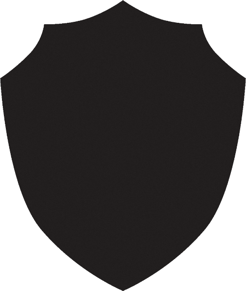 | `<SHIELD>` | `fh-shield-bw-icon.png` |
| 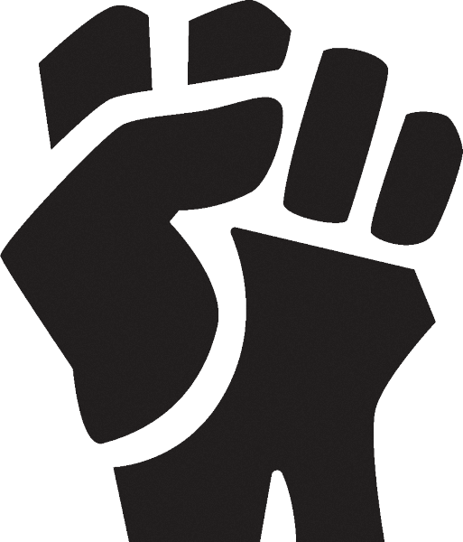 | `<RETALIATE>` | `fh-retaliate-bw-icon.png` |

## Secondary Stats & Keywords
| Symbol | Tag | Source Icon |
| :--- | :--- | :--- |
| 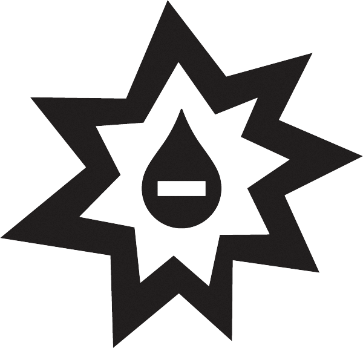 | `<DAMAGE>` | `fh-damage-bw-icon.png` |
|  | `<LOOT>` | `fh-loot-bw-icon.png` |
| 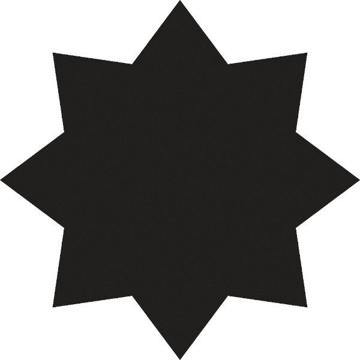 | `<XP>` | `fh-xp-bw-icon.png` |
| 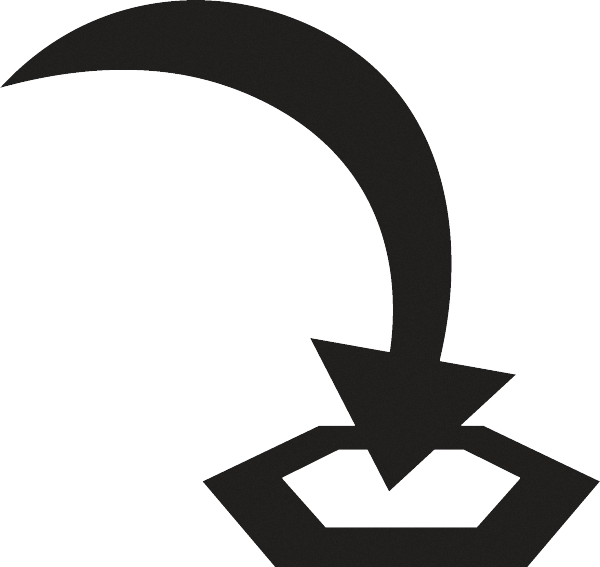 | `<JUMP>` | `fh-jump-bw-icon.png` |

## Conditions (Black & White / Inline)
| Symbol | Tag | Source Icon |
| :--- | :--- | :--- |
|  | `<DISARM>` | `fh-disarm-bw-icon.png` |
| 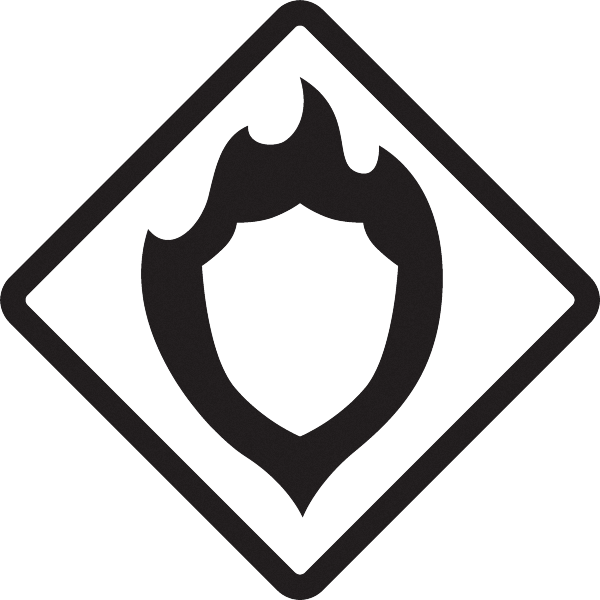 | `<WARD>` | `fh-ward-bw-icon.png` |
| 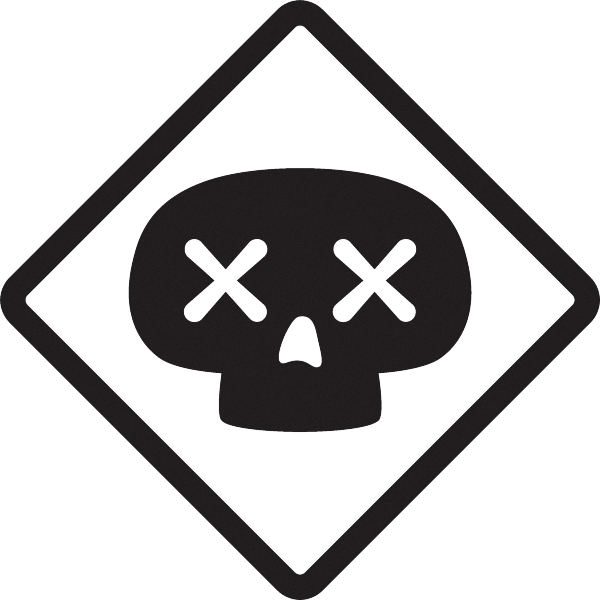 | `<POISON>` | `fh-poison-bw-icon.png` |
| 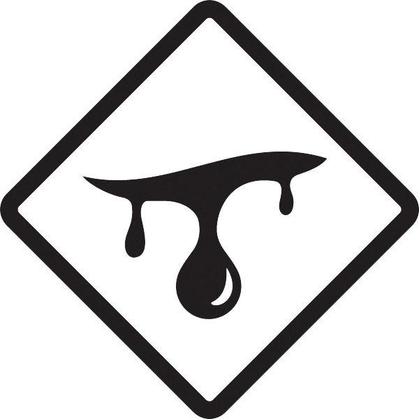 | `<WOUND>` | `fh-wound-bw-icon.png` |
| 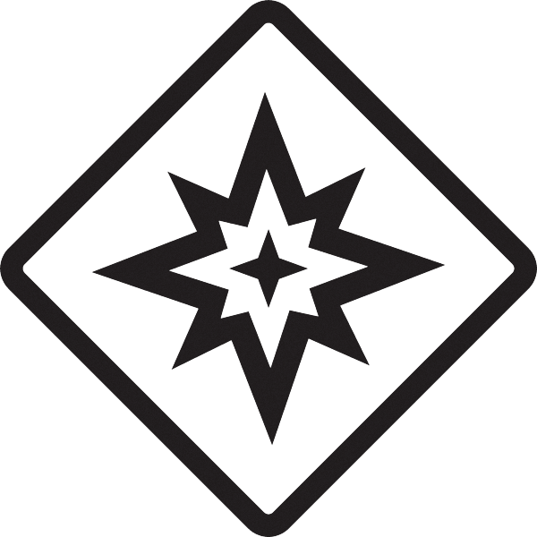 | `<STUN>` | `fh-stun-bw-icon.png` |
| 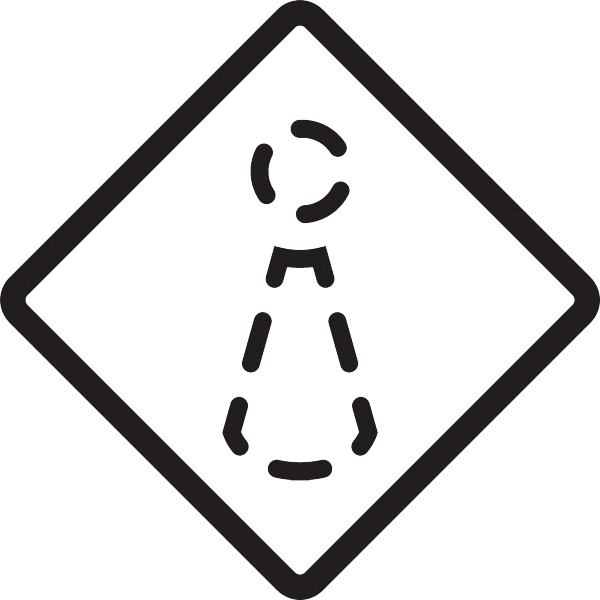 | `<INVISIBLE>` | `fh-invisible-bw-icon.png` |
|  | `<MUDDLE>` | `fh-muddle-bw-icon.png` |
| 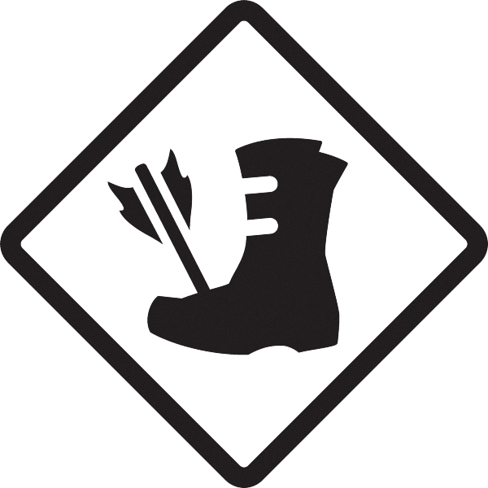 | `<IMMOBILIZE>` | `fh-immobilize-bw-icon.png` |
| 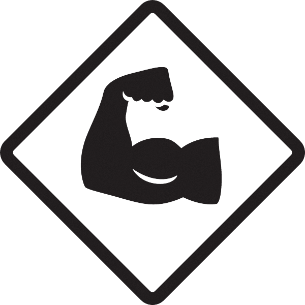 | `<STRENGTHEN>` | `fh-strengthen-bw-icon.png` |
|  | `<REGENERATE>` | `fh-regenerate-bw-icon.png` |
| 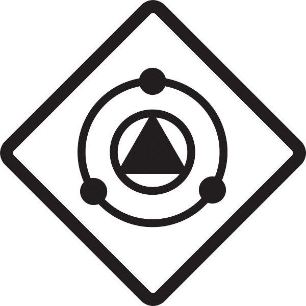 | `<BLESS>` | `fh-bless-bw-icon.png` |
| 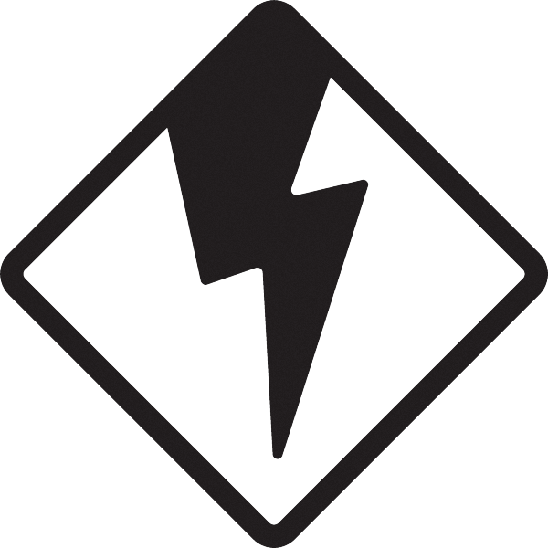 | `<CURSE>` | `fh-curse-bw-icon.png` |
